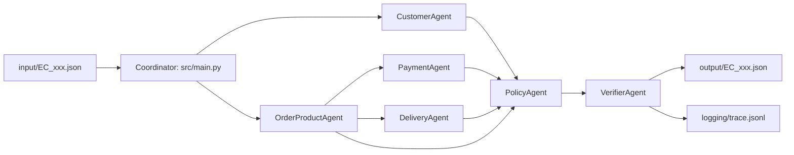

# Multi-Agent E-commerce Dispute Resolution Architecture

## Overview

The implementation is an API-backed multi-agent pipeline for `EC_POLICY_V2`.
Each specialist calls OpenRouter with `meta-llama/llama-3.1-8b-instruct` (8B)
and hands JSON reviews to the PolicyAgent; deterministic calculations and the
VerifierAgent keep output IDs, amounts and schema reproducible from CSV data.



## Agent responsibilities and access

| Agent | Assigned data / responsibility | Handoff output |
| --- | --- | --- |
| Coordinator | Reads one input case, invokes specialists, writes only verified output. | One assembled case result. |
| CustomerAgent | `orders`, `customers`; identifies `customer_unique_id` and up to five other orders for that person. | Customer context. |
| OrderProductAgent | `order_items`, `products`, `sellers`; identifies items, sellers, products and categories. | Item/product evidence. |
| PaymentAgent | `order_payments` and item evidence; totals price, freight and payments. | Reconciliation facts. |
| DeliveryAgent | Order timestamps and item shipping deadlines; calculates delivery and handoff variances. | Delivery and seller-handoff facts. |
| PolicyAgent | Reads structured handoffs only; applies the priority order in `EC_POLICY_V2`. | Issue, cause, responsibility, refund and actions. |
| VerifierAgent | Reads the assembled result; validates limits, evidence prefixes, confidence and refund/status consistency. | Pass/fail gate. |

## Handoff contract

1. The coordinator resolves `claimed_order_id` from the input against `orders`.
2. Domain agents return plain dictionaries built solely from CSV evidence; they
   do not infer tracking events or refund transactions absent from Olist.
3. The PolicyAgent applies the documented primary-issue precedence, then adds
   secondary issues and actions in the prescribed order.
4. The VerifierAgent rejects an invalid result before it can be written. A
   successful run overwrites `trace.jsonl` with exactly the newest run.

## Running

Activate the virtual environment and run:

```powershell
.\.venv\Scripts\python.exe -m src.main
```
