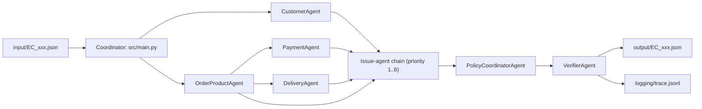

# Multi-Agent E-commerce Dispute Resolution Architecture

## Overview

The implementation is an API-backed multi-agent pipeline for `EC_POLICY_V2`.
Each specialist calls OpenRouter with `meta-llama/llama-3.1-8b-instruct` (8B).
Four domain agents calculate evidence, six independent issue agents each evaluate
one business rule, and a PolicyCoordinatorAgent applies first-match priority.
Deterministic calculations and the VerifierAgent keep every output grounded in CSV.
The model name is fixed in `src/openrouter.py` and guarded at 8B <= 10B.



## Agent responsibilities and access

| Agent | Assigned data / responsibility | Handoff output |
| --- | --- | --- |
| Coordinator | Reads one input case, invokes specialists, writes only verified output. | One assembled case result. |
| CustomerAgent | `orders`, `customers`; identifies `customer_unique_id` and up to five other orders for that person. | Customer context. |
| OrderProductAgent | `order_items`, `products`, `sellers`; identifies items, sellers, products and categories. | Item/product evidence. |
| PaymentAgent | `order_payments` and item evidence; totals price, freight and payments. | Reconciliation facts. |
| DeliveryAgent | Order timestamps and item shipping deadlines; calculates delivery and handoff variances. | Delivery and seller-handoff facts. |
| CanceledOrderIssueAgent | Checks only canceled status plus captured payment. | `matches` for priority 1. |
| UnavailableOrderIssueAgent | Checks only unavailable status plus captured payment. | `matches` for priority 2. |
| LateDeliverySellerIssueAgent | Checks only late delivery plus late seller handoff. | `matches` for priority 3. |
| LateDeliveryLogisticsIssueAgent | Checks only late delivery with no late seller. | `matches` for priority 4. |
| ValidSplitPaymentIssueAgent | Checks only payment-row count and reconciliation. | `matches` for priority 5. |
| UnsupportedLateClaimIssueAgent | Checks only on-time delivery and reconciliation. | `matches` for priority 6. |
| PolicyCoordinatorAgent | Stops at the first matching issue agent and calculates cause, responsibility, refund and actions. | Final policy decision. |
| VerifierAgent | Independently recomputes every scorable field from CSV; also validates limits, evidence, confidence and refund/status consistency. | Pass/fail gate. |

## Calculation and policy functions

- `calculate_hours_between`: timestamp difference in hours, rounded to 2 decimals.
- `calculate_payment_reconciliation`: item, freight, expected, paid, difference and tolerance check.
- `calculate_seller_handoff_analysis`: carrier handoff against each seller's earliest shipping limit.
- `calculate_delivery_analysis`: delivery variance plus seller handoff facts.
- `classify_primary_issue`: first-match issue classification in mandatory `EC_POLICY_V2` priority.
- `calculate_secondary_issues`: all related issues in their documented order.
- `calculate_resolution_actions`: primary and supplementary actions in policy order.
- `verify_against_source_data`: independent CSV-to-output verification before writing.

For an order without items, item and freight sums are `0.0`, while expected total,
difference and reconciled remain `null` because reconciliation cannot be calculated.
Missing timestamps and their derived variances also remain `null`.

## Handoff contract

1. The coordinator resolves `claimed_order_id` from the input against `orders`.
2. Domain agents return plain dictionaries built solely from CSV evidence; they
   do not infer tracking events or refund transactions absent from Olist.
3. Six issue agents run in precedence order and each evaluates only its own rule.
   The PolicyCoordinatorAgent stops at the first match, verifies it independently,
   then adds secondary issues, refund and actions in the prescribed order.
4. The VerifierAgent independently recalculates the result from CSV and rejects
   any invalid or ungrounded value before it can be written. A
   successful run overwrites `trace.jsonl` with exactly the newest run.

Confidence is calculated from issue-specific evidence completeness and the
agreement of the relevant API agents. A perfect evidence set is capped at
`0.99`; missing or unverified relevant evidence lowers the score. Evidence that
does not apply to an issue (for example delivery timestamps on an unavailable
order) does not reduce confidence.

## Running

Activate the virtual environment and run:

```powershell
.\.venv\Scripts\python.exe -m src.main
```
